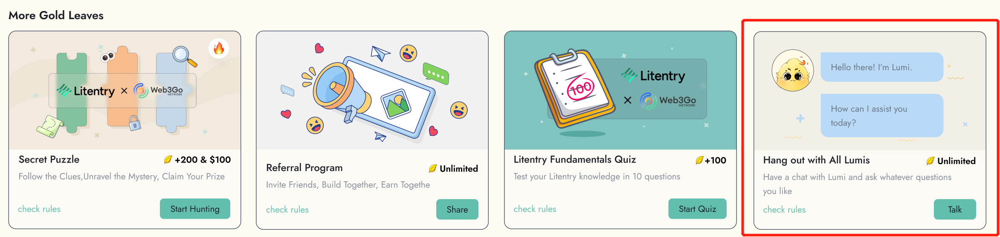

# Hang out with all Lumis

Welcome to the "Hang out with Lumi" task, where you can interact with Lumi, the Web3 assistant powered by Web3Go Intelligent ML models and the latest GPT model. By engaging with different Lumis that are assigned to different projects, you can earn gold leaves.

Currently, there are two actions that can earn you gold leaves:

**Send messages:** For every message you send to Lumi, you can earn 2 gold leaves. Check [here](../talk-to-lumi/send-message.md) to see how to send.

**Share conversations:** By sharing your conversation with Lumi, you can earn 4 gold leaves per share, up to a maximum of 10 shares per day. Check [here](../talk-to-lumi/sharing-and-introducing-lumi.md) to see how to share.

In addition to 10 free quota per day for you to talk to Lumi, you can complete additional tasks to earn more gold leaves and [boost your Lumi talking power](../talk-to-lumi/lumis-talking-power.md), which in turn will earn you more available quota.

Remember to interact with Lumi by providing feedback on Lumi's replies.Your input will help Lumi learn and improve its responses to better assist you in the future. Additionally, we value your contribution to Lumi's growth and will provide you with exciting rewards and surprises in the near future as you progress through your interactions with Lumi.

So don't hesitate, come and hang out with Lumi today and see what surprises and rewards await you!\

<figure><figcaption></figcaption></figure>
