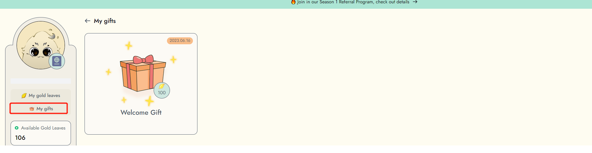

# Welcome Gift

To claim your welcome gifts, you must first [mint a Web3Go DIN Passport](../get-started-in-din/how-to-mint-passport.md). Once you have minted your passport and entered the task board, you will receive your welcome gift!&#x20;

Depending on the wallet address associated with your DIN Passport, you may receive different welcome gifts as a representation of our appreciation. These welcome gifts are designed to reward early participation and encourage engagement on the platform. They may include special bonus gold leaves or NFT attributes.&#x20;

Once you have completed this process, DIN will guide you to claim your special gift. Click open to claim your gifts.

<figure><figcaption></figcaption></figure>

Additionally, you can click on 'My Gifts' to view the gifts you have received.

<figure><figcaption></figcaption></figure>
