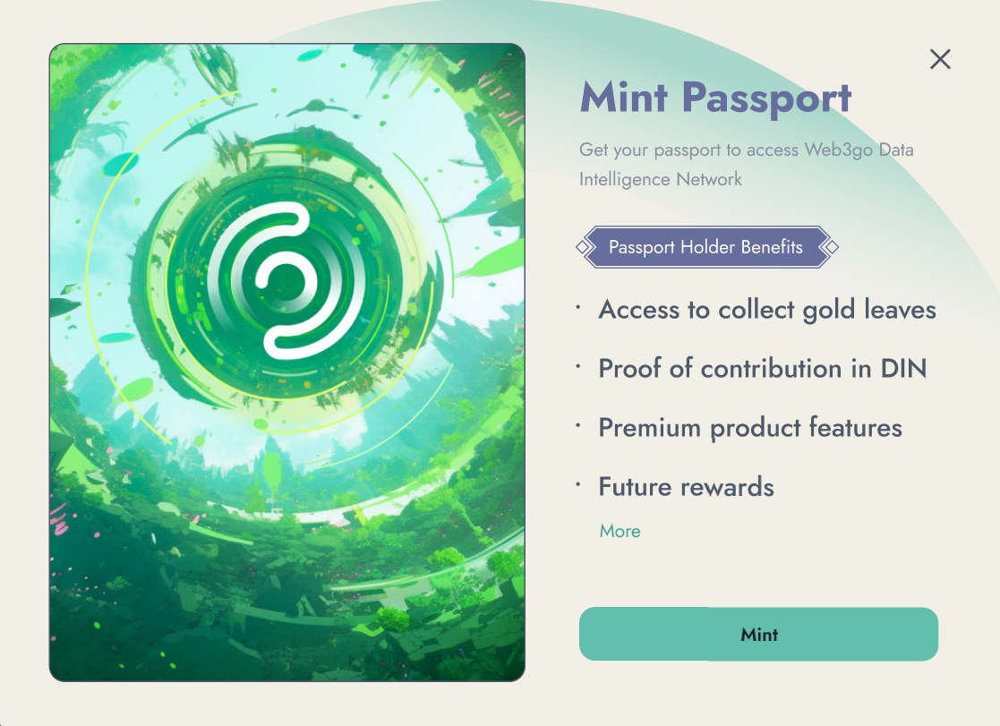

# How to Mint Passport

If you are new to DIN and do not yet have a DIN Passport, you will be prompted to mint one when you first enter the platform. A pop-up message will appear on your screen, guiding you through the process of minting your DIN Passport.

To create your DIN Passport, simply click the "Mint" button and follow the instructions provided.&#x20;

<figure><figcaption></figcaption></figure>

Once you have approved the transaction, you will own your DIN Passport and be ready to begin using DIN.  DIN is deployed on the Binance Smart Chain, so you only need to pay a small gas fee. With your DIN Passport, you will be able to collect and manage gold leaves, and participate in other activites at DIN.

<figure><figcaption></figcaption></figure>

For more benefits of holding passport, please check [here](./).\

