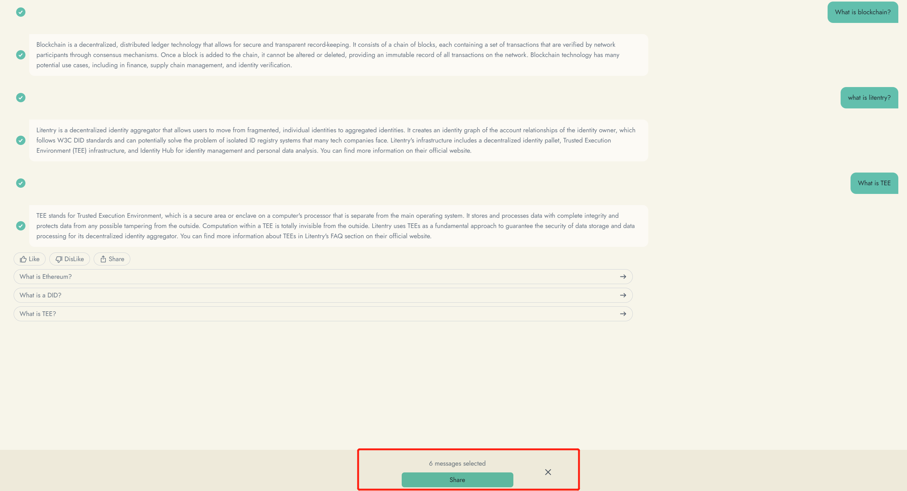

# Talk to Lumi

Our team is excited to introduce a new friend that will be coming soon to Web3Go DIN:

**Lumi, the Web3 assistant powered by Web3Go Intelligent ML models and the latest GPT model.**

Lumi is designed to provide our users with a comprehensive understanding of all project information, including the latest updates on the Internet and on-chain data. With Lumi, you will be able to stay up to date on the latest developments in the Web3 world and make more informed decisions about your investments and projects.

Currently, we want to introduce you two Lumi, Genius Lumi and Lumi@Litentry. Genius Lumi knows everything around the world and Lumi@Litentry is specialized in Litentry knowledge.&#x20;

Come to talk to them and give us some feedback through hitting on like and dislike.

<figure><figcaption></figcaption></figure>

If you loves Lumi and loves to share you conversation with Lumi or introduce Lumi to your friend. Please click share button

We've lanuched two tasks on task board so you can earn gold leaves through talking to Lumi and learn with Lumi.

&#x20;

<figure><figcaption></figcaption></figure>

Here're the tasks

Through the power of Web3Go's Intelligent ML models and the latest GPT model, Lumi will be able to analyze and interpret massive amounts of data, providing you with insights and recommendations that are tailored to your specific needs and interests.

We believe that Lumi will revolutionize the way our users interact with the Web3 ecosystem, and we are excited to bring this cutting-edge technology to the Web3Go DIN platform. Stay tuned for more updates on Lumi and how it can help you succeed in the Web3 world.
