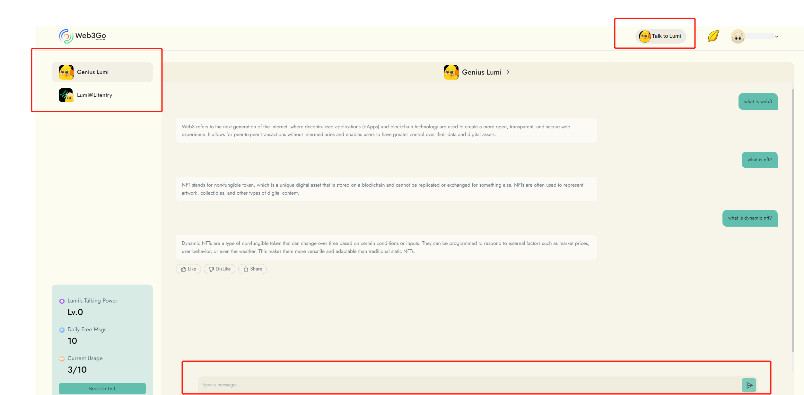

# Send Message

The "Talk to Lumi" feature allows you to have conversations with Lumi, our Web3 assistant . To use this feature, follow these steps:

1. Go to the "Talk to Lumi" page.
2. Select the Lumi you want to talk to.
3. Type your message in the input box.
4. Click the enter key or the "Send" button to send your message.

<figure><figcaption></figcaption></figure>

Please note that Lumi's talking quota is currently limited. However, you can earn more gold leaves to boost Lumi's talking power and increase the quota.&#x20;

To learn how to boost Lumi's talking power, click [here](lumis-talking-power.md).

