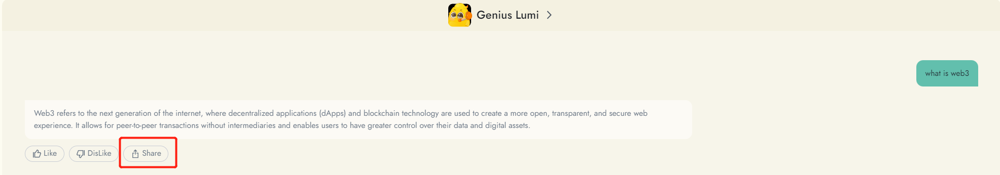
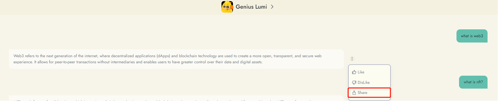
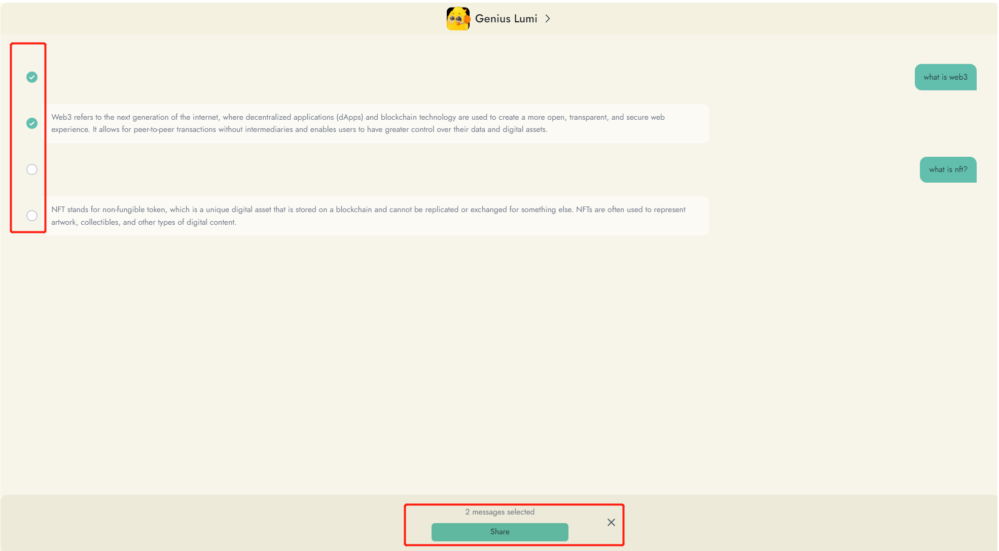
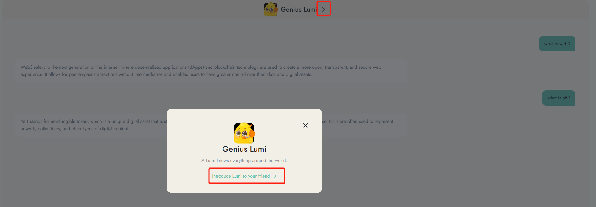

# Sharing and Introducing Lumi

Web3Go welcomes you to share your conversations with Lumi with others and introduce Lumi to your friends. Here's how you can do it:

#### Share Conversations:

1. If you find your conversation with Lumi interesting, click the "Share" button. For historical conversations, the sharing button is hidden under the 'More' button.

<figure><figcaption></figcaption></figure>

<figure><figcaption></figcaption></figure>

2. Select the message you want to share.

<figure><figcaption></figcaption></figure>

2. Copy the link to share it or share it directly with your friends.
3. By sharing your conversation with Lumi, you can earn 4 gold leaves per share, up to a maximum of 10 shares per day.

#### Introducing Lumi to Friends:

1. Find Lumi's ID by clicking on the "Introduce Lumi to your friend" button located on the conversation window.
2. Share Lumi's ID with your friends on social media or through other communication channels.
3. Spread the word about Lumi and its helpful and cute features on Twitter.

<figure><figcaption></figcaption></figure>

